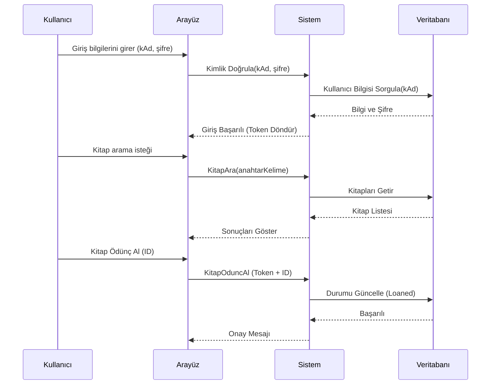

📚 Gelişmiş Kütüphane Yönetim Sistemi & AI Ajan Entegrasyonu
(JWT + Docker Compose + MCP + AI Reporting + Monitoring)

---

🚀 Proje Genel Bakış
Bu proje; modern mikroservis mimarisini, Model Context Protocol (MCP) üzerinden konuşan Yapay Zeka (AI) Ajanları ve gelişmiş izleme araçlarıyla birleştiren kapsamlı bir ekosistemdir. Sistem, bir kütüphanenin temel işlevlerini yerine getirirken, arka planda çalışan AI ajanı ile sistem metriklerini analiz eder ve raporlar sunar.

---

🧱 Sistem Mimarisi

API -> PostgreSQL

API -> JWT

Exporter -> Prometheus

Prometheus -> Grafana

MCP Server -> AI Agent -> Ollama

Open WebUI -> Ollama

---

## 📊 Sistem Akış Şeması (Sequence Diagram)

Aşağıdaki diyagram, bir kullanıcının sisteme giriş yapıp kitap arama ve ödünç alma sürecini teknik olarak göstermektedir:

---

📡 API Endpoint Örnekleri

POST /api/login

GET  /api/books

POST /api/borrow/{book_id}

POST /api/return/{book_id}

Authorization: Bearer <JWT_TOKEN>

---

🛠 Teknoloji Yığını & Yetenekler

| **Katman**   | **Kullanılan Teknolojiler**                     | **Durum** |
| ------------ | ----------------------------------------------- | --------- |
| Backend API  | Python Flask, SQLAlchemy, JWT Authentication    | ✔         |
| API Docs     | **Flasgger (Swagger UI / OpenAPI 3.0)**         | ✔         |
| Frontend UI  | Flask Client, Bootstrap 5 (Responsive)          | ✔         |
| Veritabanı   | PostgreSQL (Persistent Storage)                 | ✔         |
| AI Katmanı   | Ollama (Gemma:2b), MCP (Model Context Protocol) | ✔         |
| AI Chat      | Open WebUI (Yerel ChatGPT Arayüzü)              | ✔         |
| Monitoring   | Prometheus, Grafana, Custom Exporters           | ✔         |
| Orkestrasyon | Docker Compose (Çok Servisli Mimari)            | ✔         |

---

🔌 Mikroservis Detayları

| **Servis Adı**         | **Port** | **Açıklama**                                                                   |
| ---------------------- | -------- | ------------------------------------------------------------------------------ |
| api_service            | 5000     | Ana Backend; JWT doğrulaması ve iş mantığını yürütür.                          |
| client_service         | 5001     | Kullanıcı arayüzü; kitap ödünç alma / iade işlemlerini yönetir.                |
| library-exporter       | 8000     | Sistem verilerini (kitap ve kullanıcı sayısı) Prometheus formatına dönüştürür. |
| prometheus             | 9090     | Metrikleri toplar ve zaman serisi verisi olarak saklar.                        |
| grafana                | 3000     | Metrikleri görselleştirir (Dashboard).                                         |
| ollama                 | 11434    | Yerel LLM (Gemma) motoru; AI analizlerini sağlar.                              |
| library-reporter-agent | –        | MCP üzerinden veri çekip AI tabanlı raporlar üreten otonom ajan.               |
| open-webui             | 8080     | Ollama için gelişmiş web arayüzü ve chatbot paneli.                            |

---

🤖 AI & MCP Entegrasyonu
Proje, Model Context Protocol (MCP) kullanarak AI modellerine sistem yeteneklerini birer "tool" (araç) olarak sunar:

MCP Server (mcp_server.py): AI'nın kütüphanede arama yapmasını (search_library) ve sistem istatistiklerini (get_system_stats) almasını sağlayan araçları barındırır.

AI Reporter Agent (report_agent.py): Her saat başı MCP araçlarını kullanarak verileri toplar, Gemma:2b modeliyle analiz eder ve /reports klasörüne Markdown formatında yönetici raporu yazar.

Örnek Rapor Çıktısı: "Sistemde 5 kitap bulunmaktadır, ödünç alma oranı %40'tır. Daha fazla dünya klasiği eklenmesi önerilir.".

---

🔐 Güvenlik ve Yetkilendirme
JWT (JSON Web Token): Tüm korumalı endpoint'ler Authorization: Bearer <TOKEN> başlığı gerektirir.

Rol Bazlı Erişim (RBAC):

User: Kitap arayabilir, ödünç alabilir ve iade edebilir.

Admin: Sistem istatistiklerini görebilir, yeni kitap ekleyebilir veya silebilir.

---

▶️ Kurulum ve Çalıştırma

Sistemi Başlatın:

docker-compose up --build -d

AI Modelini İndirin (İlk sefer için):

docker exec -it ollama ollama pull gemma:2b

Adresler:

Web UI: http://localhost:5001

Chat Paneli (Open WebUI): http://localhost:8080

İzleme Paneli (Grafana): http://localhost:3000 (Giriş: admin/admin)

Metrikler (Prometheus): http://localhost:9090

Swagger API Docs (Dokümantasyon): http://localhost:5000/apidocs

👥 Test Kullanıcıları
| Kullanıcı Adı | Şifre     | Rol (Role)        |
| ------------- | --------- | ----------------- |
| admin         | adminpass | Admin (Tam Yetki) |
| user1         | pass123   | User (Standart)   |
| Nisa          | nisa94    | User (Standart)   |

---

🤖 Bonus: Yapay Zeka (AI) Güvenlik ve İyileştirme Analizi
Proje kodu yapay zeka (Gemini/ChatGPT) ile analiz edilmiş ve aşağıdaki 5 kritik öneri sunulmuştur:

Hassas Verilerin Yönetimi (.env Kullanımı):

Tespit: SECRET_KEY ve veritabanı şifreleri kod içinde açıkça yazılmış.

Öneri: Bu değerler .env dosyasına taşınmalı ve Docker ortam değişkenleri üzerinden okunmalıdır.

Parola Güvenliği (Hashing):

Tespit: Şifreler veritabanında düz metin (plain-text) olarak saklanıyor.

Öneri: Şifreler kaydedilmeden önce Werkzeug.security veya Bcrypt ile hashlenmelidir.

Girdi Doğrulama (Input Validation):

Tespit: API'ye gelen JSON verileri doğrudan işleniyor.

Öneri: Marshmallow veya Pydantic kullanılarak veri tipleri ve boş alan kontrolleri yapılmalıdır.

Rate Limiting (Hız Sınırlama):

Tespit: API üzerinde istek sınırlaması yok.

Öneri: Flask-Limiter kullanılarak IP bazlı hız sınırı (örn: dakikada 60 istek) getirilmelidir.

HTTPS ve CORS Politikaları:

Tespit: Uygulama HTTP üzerinden çalışıyor.

Öneri: Prodüksiyon ortamında SSL sertifikası (HTTPS) kullanılmalı ve CORS ayarları sadece Frontend domainine izin verecek şekilde daraltılmalıdır.

---

Bu proje, backend geliştirme, AI ajanları ve DevOps süreçlerinin birleştiği modern bir mühendislik örneğidir.

